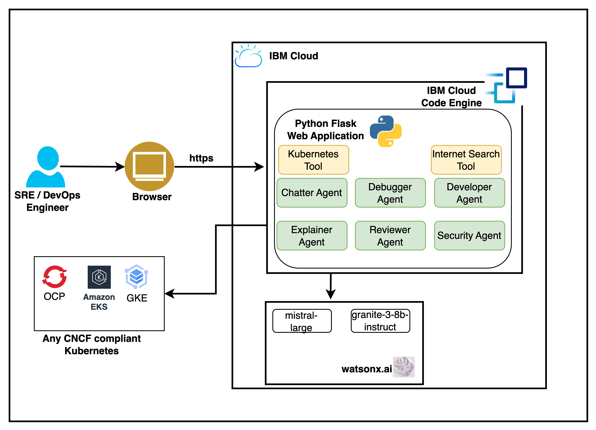

## About the asset
Managing Kubernetes and Openshift environments could be a daunting task and requires deep skills in container technology.
Leveraging Generative AI capabilities can significantly help SREs to quickly understand the issue and possible resolution; 
while can significantly boost productivity of DevOps engineers by Kubernetes Code explanation, generation and review .

This demo showcases how watsonx.ai augments to SRE & DevOps engineers' capabilities to handle day-to-day Kubernetes tasks.

## Demo Explainer
1- User can provide the kubeconfig file to connect to his/her Kubernetes/Openshift cluster. Only read permissions are 
required for the cluster.

2- After connecting to cluster, user can select a namespace to list the unhealthy pods in that namespace if troublshooting 
the issue or can select a deployment/statefulset if scanning for security vulnerabilities.

3- After this user can select an unhealthy pod and 'diagnose with watsonx' to get the summary and possible resolutions 
for the unhealthy pod. If scanning the deployment/statefulset for security vulnerabilities, user can select specific 
deployment/statefulset and ask watsonx to scan and recommend.

4- User can use 'Ask a Kubernetes Question' if he/she needs to understand what a given resolution step means or how to perform it.

5- If the issue summary/resolution indicated any problem with the pod definition, user can use 'Peer Review Kubernetes Code'
for the Pod or it's owning resource, like Deployment/StatefulSet etc.

6- If user is having any difficulty in understanding the related Kubernetes code, he/she can use 'Explain Kubernetes Code'.

7- 'Kubernetes Code Generation' can be used by SREs to generate code for Kubernetes objects like, configMaps, Secrets, 
Deployments if required.

## Architecture Diagram

## Deployment Instructions
### Instructions to run on a VM

You need to set WX_PROJECT_ID, WX_API_KEY, WX_URL, SERPER_API_KEY, TEAM_NAME and CONTACT_EMAILS as environment variables before you can execute this program:

  - `export WX_PROJECT_ID=<IBM Cloud Project id>`
  - `export WX_API_KEY=<IBM Cloud API Key>`
  - `export WX_URL=<watsonx url>`
  - `export SERPER_API_KEY=<SERPER API Key>`
  - `export TEAM_NAME=<Name of the team to display in footer of the page>`
  - `export CONTACT_EMAILS=<Comma separated email addresses for contact us page>`

Use below command to run the program:

  - `python kube-assistant.py`

### How to get a SERPER API Key

1. Go to the Serper.dev website: https://serper.dev/
2. Click on "Get Started for Free" or "Sign Up" to create a new account, or log in if you already have one.
3. Once logged in, navigate to the dashboard.
4. You will find your API key listed in the dashboard. Copy this key.
5. Use this key as the value for the `SERPER_API_KEY` environment variable in your `.env` file or when exporting environment variables.

### Instructions to build and run on docker
    
  Create .env file and copy-paste content from env_sample. Update the value of environment variables specific to your env.

  Now the docker image:

  - `docker build -t kube_assistant_dsce:latest .`
  
  Run the docker image:
  
  - `docker run -p 8080:8080 kube_assistant_dsce:latest`

  Access the application at the port 8080.

  ## 📫 Contact

For deployment support, contact [anand.awasthi@in.ibm.com](mailto:anand.awasthi@in.ibm.com)
